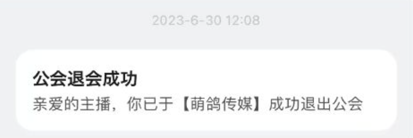

私は6月30日をもって前のギルドを脱退しました。
<!--truncate-->
## 原文

今回はギルドについてお話したいと思います。

私は6月30日をもって前のギルドを脱退しました。

まず私がギルドに入った経緯について、ビリビリの経営方針の移行でビリビリからの配信サポートがなくなり、

今後収益を受け取れなくなるかもしれないということを知り、ギルドに加入しました。

ギルドでは主に配信サポート（配信についての注意特記や流行りの動画ジャンルや中国の最近の情報の他）

動画作成のサポートをしていただきました。

字幕組でも動画は作って頂いていますが、

無償でやって頂いている分字幕組に参加している皆には自分の時間を大切にして欲しいという気持ちが大きいです、正直みんなが好きにサポートしてくれるだけですごくありがたいです。

そうした理由から多くのことを字幕組にお願いするのは私的に少し気が引けていました。

その時丁度ギルドに声をかけていただいたので、

丁度動画に力を入れていきたいと思っていた私的にはすごく助かっていました。

現在までに5本の動画を作って頂いています。

私は今ビリビリと個人契約をしています。個人契約の満了期間はあと半年くらいです。

満了期間後に契約の更新はもしかしたらできないかもしれません。

もしそうなりますと収益が受け取れなくなり、配信していくことが難しくなります。

今後契約がどうなるか分からないため、何処かのギルドに入ることを検討しています。

私には嬉しいことに一定数以上のフォロワーさんがいます。

しかしフォロワーが一定数以上いる場合、どこでも好きにギルドに入れるわけではありません。

大きなギルドがポイントと引き換えに私を加入させる方法しかありません。

ビリビリの方針が今後どうなるのか私自身も把握しきれていないため、契約満了ギリギリまで

個人契約でいるつもりですが、契約の更新ができなかった場合はギルドに加入することになると思います。

ご理解の程よろしくお願いいたします。

また、誘っていただけるギルド様がいれば是非ご連絡お待ちしております。

最後に、いつも星宮汐と明を応援してくれて本当にありがとうございます。

今後また何か変動があったらみんなに告知したいと思います。

また、この度はご心配をおかけして誠に申し訳ございませんでした。

今後は分からないことあったら字幕組の人と相談しながら決めて行きたいと思います。

今後とも皆がHAPPYになれるような配信と動画を作っていくのでよろしくお願いします！

星宮汐

## 中文翻译
这次想和大家说一下有关公会的事情。

我已经于6月30日退出了之前的公会。

首先说一下当初加入公会的经过，最初的起因是听说因为B站的运营方针的改变，由B站官方负责的直播支援将会取消，就连直播的收益也可能会无法顺利领取，所以我在今年3月加入了公会。

公会对我的帮助主要有：告诉我有关直播方面的注意事项，流行的视频类型还有关于中国的时事消息等，以及切片视频的制作。

虽然也有字幕组帮我制作视频，但是毕竟是无偿制作的，我希望字幕组的大家能把更多的时间用在自己的身上，说实话能得到大家志愿的帮助已经很感谢了。因此对我来说有些难以委托字幕组参与过多的事务。

这个时候刚好受到了公会的邀请，正好当时我也想要努力多做视频所以对我来说很有帮助。

到现在为止公会帮我制作了5个视频。

现在我和B站官方签订的个人合约还在期限内，不过还有半年左右就要到期了。

合约到期后也许无法再次续约。

如果无法续约的话收益也无法顺利领取，可能会难以继续直播。

现在我还不能确定有关合约的问题之后会有什么变化，所以也在考虑以后选择一个公会加入。

很荣幸我在B站有了一定的粉丝规模。

但是在粉丝数到达一定程度后，不是任何公会都能随意按照自己的想法选择加入。

需要大型的公会花费点数才能让我加入。

因为我无法确定B站的方针会有何变化，所以打算在个人合约结束前都尽可能保持个人的状态。但是如果无法确认能否顺利续约的话有可能会加入公会。希望大家能够理解。

另外，如果有公会想要邀请我加入的话请联系我。

最后感谢大家一直以来对星宫汐和星宫明的支持。

今后如果再次出现变动我会告知大家。

另外因为这次的事情让一些粉丝担心了，我感到非常抱歉。

今后如果出现不明白的事我会和字幕组商量着决定。

今后我也会继续给大家带来快乐的直播和视频，敬请期待！

星宫汐